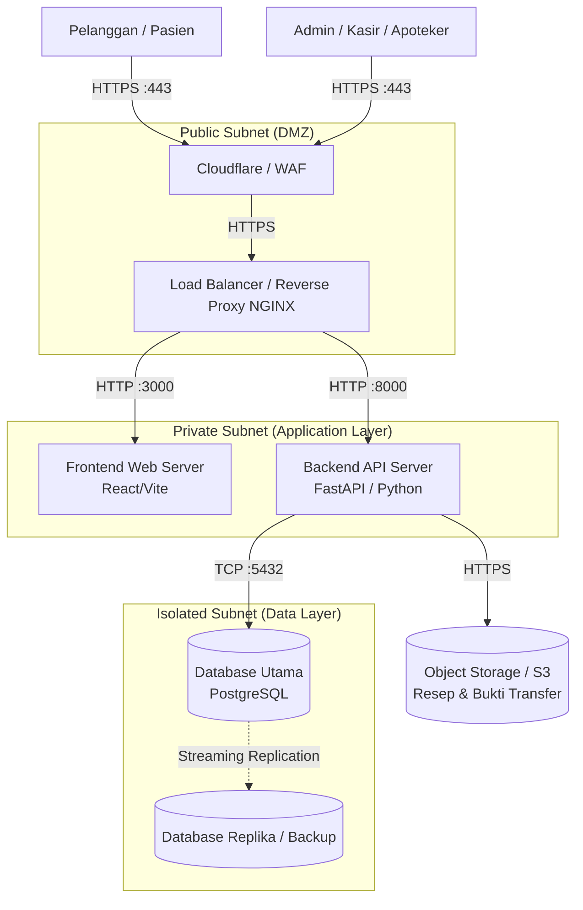

# Dokumen Arsitektur Perangkat Keras dan Jaringan
**Sistem E-Commerce & POS Klinik Makmur Jaya**

Dokumen ini menjelaskan topologi jaringan dan spesifikasi perangkat keras (*hardware*) yang direkomendasikan untuk menunjang operasional aplikasi Klinik Makmur Jaya secara aman, berkinerja tinggi, dan skalabel.

---

## 1. Topologi Jaringan dan Server

Sistem ini dirancang menggunakan arsitektur *3-Tier* yang dikembangkan dalam lingkungan *Virtual Private Cloud (VPC)* untuk mengisolasi titik akses publik dari data sensitif di *database*.

### Diagram Topologi Arsitektur

### Penjelasan Komponen Jaringan:
1. **WAF & CDN (Cloudflare):** Berfungsi sebagai garda terdepan untuk melindungi server dari serangan DDoS, *SQL Injection*, dan mempercepat pemuatan aset statis (gambar, *file* CSS/JS) melalui Jaringan Pengiriman Konten (CDN).
2. **Reverse Proxy (NGINX):** Mengelola SSL/TLS (*HTTPS*), mengatur rute (*routing*) lalu lintas ke Frontend dan Backend, serta memungkinkan *Load Balancing* jika server Backend diperbanyak.
3. **Application Server (Private Subnet):** Server tempat berjalannya antarmuka web (Frontend) dan logika bisnis (Backend API). Server ini tidak memiliki alamat IP Publik (*isolated*), hanya bisa diakses lewat NGINX.
4. **Database Server (Isolated Subnet):** Server *database* ditempatkan di lapisan jaringan yang sepenuhnya tertutup dari internet. Hanya Backend API yang diizinkan melakukan komunikasi port `5432` ke *database*.

---

## 2. Spesifikasi Perangkat Keras (Rekomendasi Skala Menengah)

Untuk menangani operasional klinik skala menengah dengan perkiraan pengguna aktif bersamaan (kasir, admin, pelanggan) sebanyak 100 - 500 pengguna, spesifikasi *Virtual Machine* (VM) atau *Bare-metal* berikut direkomendasikan:

### A. Web & API Server (Aplication Node)
Server ini menjalankan `Node.js` (untuk penyajian *Frontend*) dan `Gunicorn/Uvicorn` (untuk *Backend FastAPI Python*).
- **CPU:** 4 vCPU
- **RAM:** 8 GB DDR4
- **Storage:** 50 GB SSD / NVMe (hanya untuk *log* lokal dan OS sistem)
- **Sistem Operasi:** Ubuntu Server 22.04 LTS / Debian 12

### B. Database Server Utama (PostgreSQL Node)
Server ini memproses seluruh transaksi POS dan transaksi _online_. Karena aktivitas *database* sangat intensif dalam hal *input/output* (I/O), disarankan menggunakan SSD tipe NVMe.
- **CPU:** 8 vCPU
- **RAM:** 16 GB DDR4 / DDR5 (agar mampu melakukan *caching database* dengan baik)
- **Storage:** 100 GB NVMe (dilengkapi konfigurasi RAID 1 jika menggunakan *bare-metal* untuk keamanan fisik)
- **Sistem Operasi:** Ubuntu Server 22.04 LTS

### C. Reverse Proxy & Load Balancer Node (NGINX)
Server ringan untuk merutekan permintaan.
- **CPU:** 2 vCPU
- **RAM:** 4 GB DDR4
- **Storage:** 25 GB SSD
- **Sistem Operasi:** Ubuntu Server 22.04 LTS

### D. Media / Object Storage
Penyimpanan khusus (bukan *block storage* VM) untuk menyimpan aset foto berukuran besar seperti: foto profil, foto bukti transfer, dan pindaian resep dokter.
- **Tipe:** Amazon S3 Compatible Storage (misal: AWS S3, MinIO, atau DigitalOcean Spaces)
- **Kapasitas:** Mulai dari 50 GB (skalabel otomatis).

---

## 3. Topologi Lingkungan Klinik (Hardware Kasir)

Di lingkungan fisik klinik Makmur Jaya, perangkat yang dibutuhkan adalah:
- **Router / Firewall:** MikroTik atau perangkat sejenis untuk mengelola WiFi karyawan dan memisahkan jaringan kasir dengan pengunjung (*Guest WiFi*).
- **Komputer Kasir / Apoteker:** PC Mini atau Laptop dengan RAM minimal 4GB dan peramban web modern (Google Chrome / Microsoft Edge).
- **Perangkat Pendukung POS:**
  - *Barcode Scanner* 2D (untuk memindai obat).
  - *Thermal Printer* 58mm / 80mm (untuk mencetak struk).
  - Laci Kas Uang (*Cash Drawer*) yang dihubungkan ke *Printer* melalui koneksi RJ11.
