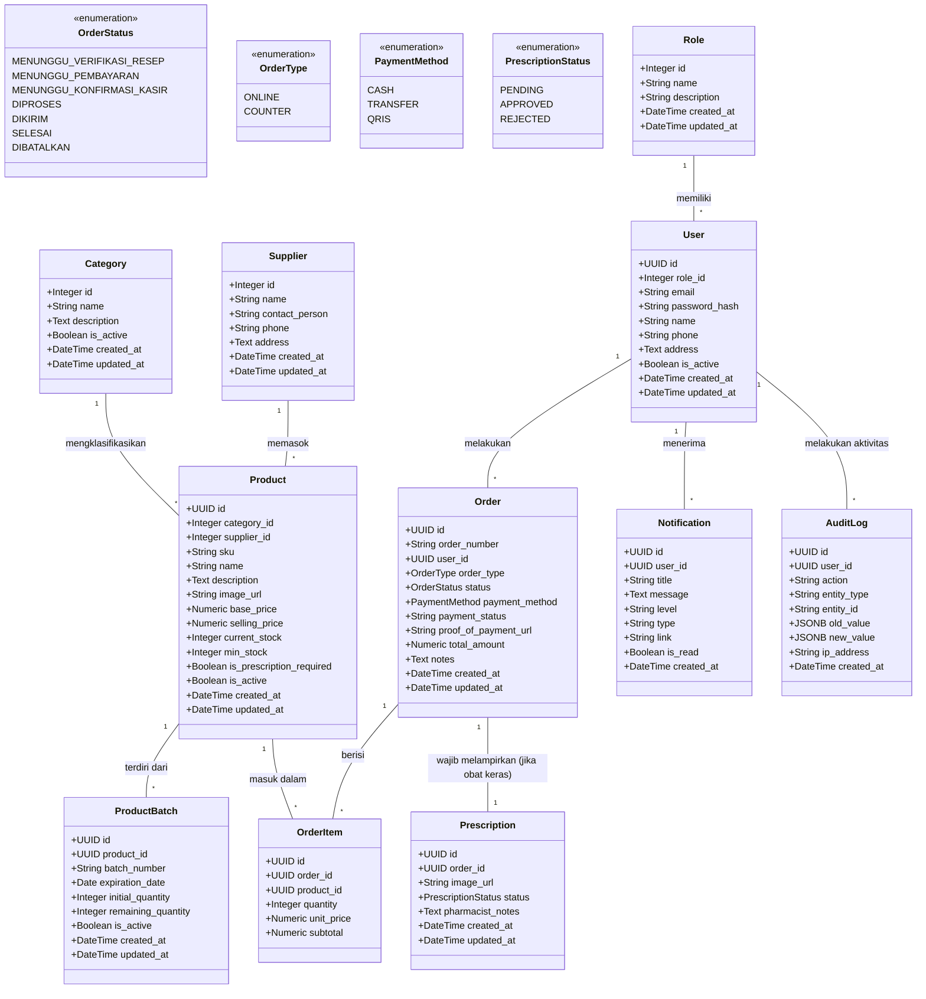

# Diagram Kelas (Class Diagram)
**Sistem E-Commerce & POS Klinik Makmur Jaya**

Dokumen ini mendeskripsikan secara teknis Entitas Database (*SQLAlchemy ORM Models*) beserta hubungan kardinalitas antar-entitas (1:1, 1:M, M:M) yang menopang logika bisnis aplikasi.

---

## Diagram Model Data

Berikut adalah visualisasi struktur *Database* menggunakan representasi *Class Diagram*:

---

## Keterangan Relasi

1. **User (Pengguna) & Role (Peran): `(M:1)`**
   Setiap Pengguna di sistem wajib memiliki persis satu peran (misalnya: *Admin*, *Kasir*, *Pasien*), sedangkan satu peran dapat dimiliki oleh banyak Pengguna.

2. **Product (Produk) & Category/Supplier: `(M:1)`**
   Setiap Produk tergabung dalam satu Kategori dan disuplai oleh satu *Supplier* Utama. Hal ini memudahkan rekapitulasi data barang saat restok.

3. **Product (Produk) & ProductBatch: `(1:M)`**
   Untuk menerapkan sistem peringatan kedaluwarsa secara spesifik, satu jenis Produk (misal: Paracetamol) dapat memiliki banyak *Batch* (dengan nomor *batch* dan tanggal kedaluwarsa yang berbeda-beda). Sisa stok pada `Product` adalah kalkulasi dinamis atau agregasi dari total *remaining quantity* pada seluruh *batch* aktifnya.

4. **Order (Pesanan) & OrderItem: `(1:M)`**
   Sebuah *Order* atau struk belanja dapat berisi banyak baris item belanjaan (*OrderItem*), di mana setiap *OrderItem* mereferensikan satu `Product` spesifik beserta jumlah (*quantity*) dan subtotal harganya.

5. **Order (Pesanan) & Prescription (Resep): `(1:1)`**
   Jika pesanan memuat minimal satu produk berlabel *Obat Keras* (`is_prescription_required = True`), maka pesanan tersebut wajib memiliki tepat 1 entitas *Prescription* terlampir yang berisi foto unggahan resep dokter untuk diverifikasi oleh Apoteker.

6. **AuditLog & Notification**
   Semua log audit dan notifikasi terhubung langsung ke entitas Pengguna (`User`). *Audit Log* menyimpan jejak langkah (sebelum vs sesudah dalam format *JSONB*) dari sebuah aksi untuk akuntabilitas, sedangkan *Notification* menyimpan pesan pemberitahuan persisten.
